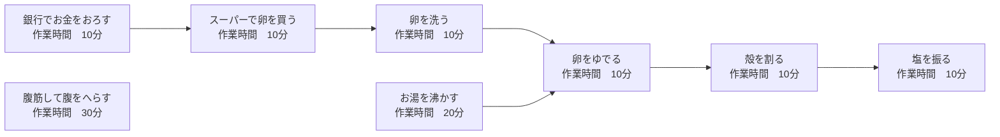

```mermaid
graph LR;
o_1["銀行でお金をおろす
作業時間　10分"]

o_2["スーパーで卵を買う
作業時間　10分"]

o_3["卵を洗う
作業時間　10分"]

t_1["お湯を沸かす
作業時間　20分"]

t_2["卵をゆでる
作業時間　10分"]

t_3["殻を割る
作業時間　10分"]

t_4["塩を振る
作業時間　10分"]

s_1["腹筋して腹をへらす
作業時間　30分"]

o_1 --->o_2
o_2 --->o_3
o_3 --->t_2
t_1 --->t_2
t_2 --->t_3
t_3 --->t_4

```