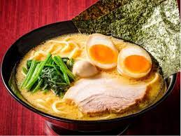

# 町田商店
---
  
**一杯**へのこだわり。  
**家系**への想い。  
横浜家系ラーメンは、1974年以降に神奈川県横浜市で生まれた豚骨醤油ベースの中太麺を特徴とするラーメン。元々屋号に「〜家」とつける店が多かったことから、家系(いえけい)と呼ばれるようになりました。豚骨や鶏ガラから取ったダシに醤油のタレを混ぜた「豚骨醤油ベース」のスープに、モチモチとした独特の食感を持つストレートの中太麺。ほうれん草やチャーシュー、海苔をトッピングの基本とし、味の濃さやスープの脂の量、麺のゆで加減の調整、トッピングの追加などによるアレンジが可能であることなどを特徴としています。

最高の味は、  
最高のステージがつくる。  
おいしいラーメンのみを提供すれば良いという想いは一切ありません。スタッフが明るくて、店内が活気で溢れている。 そして、職人が想いを込めて一杯のラーメンと向き合っている。「また来たくなるお店」をつくるのは、決して味だけではありません。その一杯にストーリーを感じていただけるか。美味しい。楽しい。心地いい。最高の一杯を提供するために、 店舗をステージと考える。お客様の喜びのために、私たちは空間づくりをラーメンの味と同じくらい大切に考えています。  
[詳しく知りたい方はこちら](https://www.machidashoten.com/)  
[戻る](index.md)