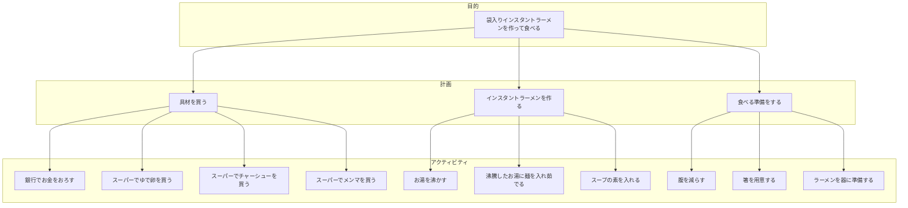

```mermaid
flowchart TB
subgraph "目的"
o_1["袋入りインスタントラーメンを作って食べる"]
end

subgraph "計画"
t_1["具材を買う"]
t_2["インスタントラーメンを作る"]
t_3["食べる準備をする"]
end

subgraph "アクティビティ"
s_1["銀行でお金をおろす"]
s_2["スーパーでゆで卵を買う"]
s_3["スーパーでチャーシューを買う"]
s_4["スーパーでメンマを買う"]
s_5["お湯を沸かす"]
s_6["沸騰したお湯に麺を入れ茹でる"]
s_7["スープの素を入れる"]
s_8["腹を減らす"]
s_9["箸を用意する"]
s_10["ラーメンを器に準備する"]
end

o_1 ---> t_1
o_1 ---> t_2
o_1 ---> t_3

t_1 ---> s_1
t_1 ---> s_2
t_1 ---> s_3
t_1 ---> s_4
t_2 ---> s_5
t_2 ---> s_6
t_2 ---> s_7
t_3 ---> s_8
t_3 ---> s_9
t_3 ---> s_10

```